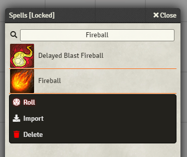
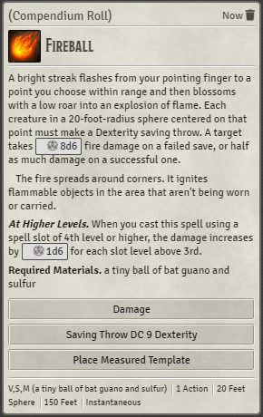
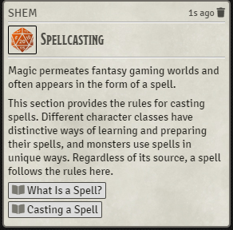
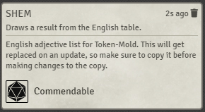

# [Roll From Compendium](https://foundryvtt.com/packages/roll-from-compendium/)

 
 
  

Add compendium context menu option to roll an item (casting a spell, showing a feature, etc).

# Features

This module adds a new context menu button to the Compendium window. When right-clicking an item from the list,
you will have a new option - Roll.

When clicking this option, the item will be "rolled", and a card will be shown in the chat:
- A spell will be cast
- A weapon will be used, allowing an attack and damage roll
- A feature will be described
- etc. for "Item" type compendiums (all of which have a roll() function)
- Journal Entries will show a message with their title and description
- Actors and Scenes will just have their basic info (image and name) shown in the chat

# Dummy Actor
When Item items (spells, weapons, equipment, features...) are rolled, they will be rolled as if they belong to an actor.

If you are selecting a token while rolling, it will be as if the item is used by that actor. This means that, for
example, a weapon will use the abilities of the character, and a 5e spell will have a saving throw DC based on the
character's statistics.

However, if no token is selected, a "dummy actor" will be created (once) and used for that purpose. The dummy actor can
be found in the Actors tab, named "(Compendium Roll)". If you want to change the default actor used to cast

# Note for D&D 5th Edition
- When casting a spell with no actor or a spell your selected character is unable to cast, you'll want to toggle
 off "Consume spell slot" in the dialog that opens; otherwise it will fail to cast. This is because of a bug in
 the 5e system - its code can't deal with someone casting a spell they don't have the right spell slots for.