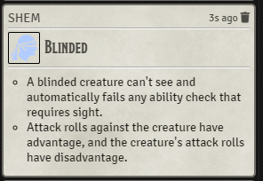
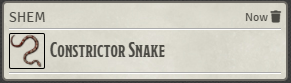
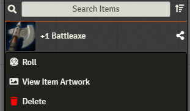
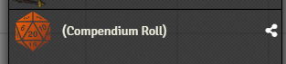

# [Roll From Compendium](https://foundryvtt.com/packages/roll-from-compendium/)

 
 
  

Add compendium context menu option to roll an item (casting a spell, showing a feature, etc).

# Features

This module adds a new context menu button to the Compendium window. When right-clicking an item from the list,
you will have a new option - Roll.

When clicking this option, the item will be "rolled", and a card will be shown in the chat:
- A spell will be cast
- A weapon will be used, allowing an attack and damage roll
- A feature will be described
- etc. for "Item" type compendiums (all of which have a `roll()` function, which this module calls)
- Journal Entries will show a message with their title and description
- Actors and Scenes will just have their basic info (image and name) shown in the chat

A button will also be added to the header of the item sheet (and journal sheet) - behaving in the same way.

A similar button will be added to the "Items" sidebar, for each item, when right-clicking it.

# Dummy Actor
When "Item" items (spells, weapons, equipment, features...) are rolled, they will be rolled as if they belong to an actor.

If you are selecting a token while rolling (or if you're rolling from the sheet header on an item that belongs to an 
 actor), it will be as if the item is used by that actor. This means that, for example, a weapon will use the abilities 
 of the character, and a 5e spell will have a saving throw DC based on the
 character's statistics.

However, if no token is selected, a "dummy actor" will be created (once) and used for that purpose. The dummy actor can
 be found in the Actors tab, named "(Compendium Roll)". If you want to change the default actor used for this purpose,
 you'll need to alter this actor after it has been created for the first time, or rename an existing actor to have that
 name.

# BetterRolls

This module is compatible with [BetterRolls for 5e](https://github.com/RedReign/FoundryVTT-BetterRolls5e), and will call
 the BetterRolls' "quick roll" option on items.  If you want to disable/ignore it, hold the Alt key while clicking.

# Note for D&D 5th Edition
- When casting a spell with a dummy actor when your selected character doesn't have the spell slots for it, you'll want 
to toggle off "Consume spell slot" in the dialog that opens; otherwise it will fail to cast. This is because of a bug in
 the 5e system - its code can't deal with someone casting a spell they don't have the right spell slots for.
- If you press a button on the rolled item's chat message (e.g. the damage of a sword attack) - it will treat the item
 as if it belongs to the latest actor that used the compendium item, regardless of which actor was linked to the message.
  This means it might be using the wrong actor's stats if you press a button on an "old" message after switching your
  selected actor.
  This is a known bug (that I don't know how to solve).

# Note for Pathfinder 2nd Edition (pf2e)
- Fully compatible! (as of v1.2.0)