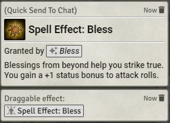

# [Quick Send To Chat](https://foundryvtt.com/packages/roll-from-compendium/)

 
 
  

Add easy buttons to post things to chat.  Quickly cast a spell from a compendium, roll from a table, post the image of an NPC, or attack with a weapon that isn't in your inventory.

# Features

This module adds several buttons that do pretty much the same thing: Post/roll something.

Right click (context menu options) are added to:
- Compendium pack contents
- Sidebar entries (including in folders) for actors, items, journals, scenes, etc

Header buttons are also added to sheets. The new option is named "💬 To Chat".

When clicking this option, the sheet's contents will be used to post a card in the chat, depending on the exact document type:
- (dnd5e, pf2e) A spell will be cast.
- (dnd5e) A weapon will be used, allowing an attack and damage roll
- (pf2e) An Effect will be posted to the chat, along with an embedded link that can be immediately dragged onto a token.
- Any other Item will have its name, image, and full description posted.
- Actors, and Scenes will post the name and the image
- Journal Entries will show their contents along with an image if one exists.
- Rollable Tables will have a random item drawn from them. (icon isn't perfect, oh well)
- Macros will be executed. (icon isn't perfect, oh well)

Hold Ctrl to make the message private ("self" only visibility), just like how many systems already do it.

Hold Shift to send a link to the item, rather than the item itself.  This link will be a small clickable button, shown
as its own message, with the text being the item's name.  Clicking it will open the item sheet (if user has permissions).

Pathfinder 2E - draggable effect:

Actors will only have their name and image revealed, with name being a private message which you can choose to reveal to your players

# Dummy Actor
When "Item" items (spells, weapons, equipment, features...) are sent, they will be sent as if they belong to an actor.

If you are selecting a token while sending to chat (or if you're doing it from the sheet header on an item that belongs to an 
 actor), it will be as if the item is used by that actor. This means that, for example, a weapon will use the abilities 
 of the character, and a 5e spell will have a saving throw DC based on the
 character's statistics.

However, if no token is selected, a "dummy actor" will be created (once) and used for that purpose. The dummy actor can
 be found in the Actors tab, named "(Quick Send To Chat)". If you want to change the default actor used for this purpose,
 you'll need to alter this actor after it has been created for the first time, or rename an existing actor to have that
 name.

You can disable this dummy actor in the settings;  if you find yourself needing to do that, let me know, and I'll change
 the defaults for that system to be enabled/disabled as necessary.

This dummy actor is necessary in D&D 5e and in PF2E, at least.

No special compatibility with Ready Set Roll; Please let me know if this is important to you!

