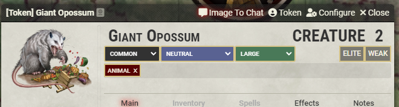

# [Quick Roll To Chat](https://foundryvtt.com/packages/roll-from-compendium/)

 
 
  

Add easy buttons to post things to chat.  Quickly cast a spell from a compendium, roll from a table, post the image of an NPC, or attack with a weapon that isn't in your inventory.

# Features

This module adds several buttons that do pretty much the same thing: Post/roll something.

Right click (context menu options) are added to:
- Compendium pack contents
- Sidebar entries (including in folders) for actors, items, journals, scenes, etc

As are header buttons for sheets of Actors, Items, and Journals.

The new option is named Quick Roll To Chat, Description To Chat, Cast To Chat, Image To Chat, etc.

When clicking this option, the sheet's contents will be used to post a card in the chat, depending on the exact document type:
- (dnd5e, pf2e) A spell will be cast.  Spell slot can be chosen.
- (dnd5e) A weapon will be used, allowing an attack and damage roll (compatible with Better Rolls for 5e)
- (pf2e) An Effect will be posted to the chat, along with an embedded link that can be immediately dragged onto a token.
- Any other Item will have its name, image, and full description posted.
- Actors, and Scenes will post the name and the image (name will be a separate private message which you can choose to reveal)
- Journal Entries will show their contents along with an image if one exists.
- Rollable Tables will have a random item drawn from them.
- Macros will be executed.

# Dummy Actor
When "Item" items (spells, weapons, equipment, features...) are rolled, they will be rolled as if they belong to an actor.

If you are selecting a token while rolling (or if you're rolling from the sheet header on an item that belongs to an 
 actor), it will be as if the item is used by that actor. This means that, for example, a weapon will use the abilities 
 of the character, and a 5e spell will have a saving throw DC based on the
 character's statistics.

However, if no token is selected, a "dummy actor" will be created (once) and used for that purpose. The dummy actor can
 be found in the Actors tab, named "(Compendium Roll)". If you want to change the default actor used for this purpose,
 you'll need to alter this actor after it has been created for the first time, or rename an existing actor to have that
 name.

# BetterRolls

This module was compatible with [BetterRolls for 5e](https://github.com/RedReign/FoundryVTT-BetterRolls5e), and will call
 the BetterRolls' "quick roll" option on items.  If you want to disable/ignore it, hold the Alt key while clicking.

Foundry V10 compatibility with Ready Set Roll - TBD. (let me know if this is critical for you).

# Note for Pathfinder 2nd Edition (pf2e)
- Fully compatible! (as of v4.0.0-beta3)

# Note for D&D 5th edition (dnd5e)
- Fully compatible! (as of v2.0.2)
